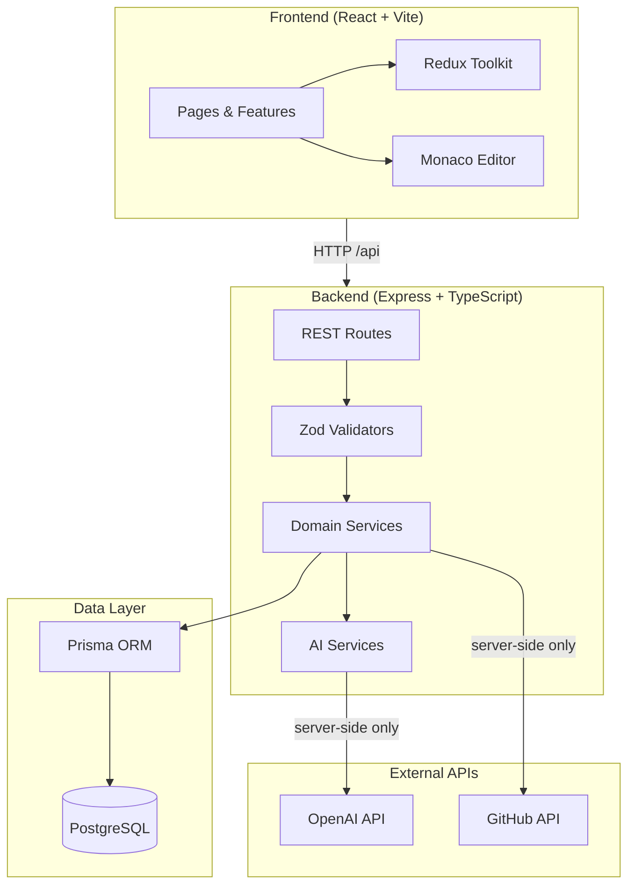
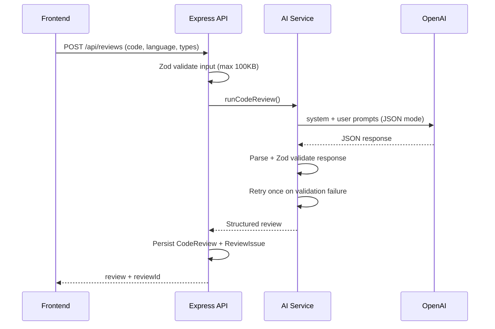
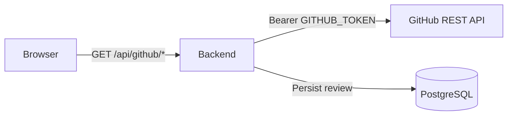
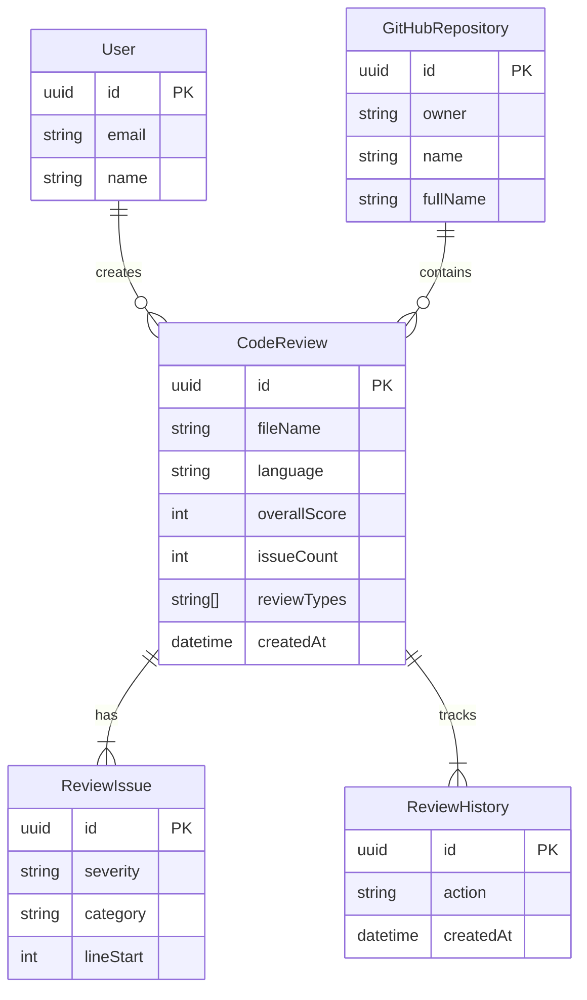

# AI Code Review & Developer Assistant

An enterprise-style developer platform for AI-powered code review, refactoring, explanation, documentation, test generation, and GitHub repository integration. Built as a full-stack TypeScript application suitable for portfolio demos and technical interviews.

## Problem

Modern engineering teams spend significant time on repetitive code review tasks: catching bugs, enforcing standards, writing tests, and documenting changes. Manual review is slow, inconsistent, and difficult to scale across repositories and pull requests.

## Solution

ACRA (AI Code Review Assistant) centralizes AI-assisted developer workflows in a single workspace. Developers paste code or connect a GitHub repository, run focused AI analyses, and review structured findings with severity, line references, and actionable suggestions. Results are persisted for dashboards, history, and trend analysis.

## Features

| Category | Capabilities |
|----------|-------------|
| **AI Code Review** | Structured findings with severity, category, line numbers, suggestions |
| **Refactoring** | Before/after diff with improvement rationale |
| **Explanation** | Purpose, flow, key functions, and potential issues |
| **Documentation** | JSDoc, Markdown, README, and API docs |
| **Test Generation** | Vitest, Jest, and React Testing Library output |
| **GitHub Integration** | Browse repos, files, branches; review files and PRs |
| **Dashboard** | Metrics, charts, and recent reviews from database |
| **Review History** | Searchable, filterable, paginated review archive |
| **Monaco Editor** | Syntax highlighting, issue line decorations, diff viewer |

## Architecture



## Tech Stack

| Layer | Technologies |
|-------|-------------|
| Frontend | React 19, TypeScript, Vite, MUI, Redux Toolkit, React Router, Monaco Editor, Recharts, Axios |
| Backend | Node.js 20, Express 5, TypeScript, Zod, Helmet, express-rate-limit |
| Database | PostgreSQL 16, Prisma ORM |
| AI | OpenAI Chat Completions (JSON mode) |
| DevOps | Docker, Docker Compose, GitHub Actions |

## AI Architecture



**Design principles:**
- OpenAI calls occur **only on the server** — API keys never reach the browser
- Modular prompts per feature (review, refactor, explain, docs, tests)
- All AI responses validated with Zod schemas
- Invalid JSON triggers a single retry with schema correction instructions
- Prompts instruct the model not to invent unsupported issues
- Input capped at 100KB; rate limits on general and AI endpoints

## GitHub Integration



- `GITHUB_TOKEN` is stored server-side only
- Supports repository browsing, file content, branch selection, file review, and PR review
- File extension allowlist prevents reviewing binaries or unsupported types
- Rate limit and auth errors mapped to user-friendly HTTP responses

## API Architecture

| Endpoint | Method | Description |
|----------|--------|-------------|
| `/api/health` | GET | Service health and config status |
| `/api/reviews` | POST | AI code review (persisted) |
| `/api/reviews/history` | GET | Paginated review history |
| `/api/reviews/:id` | GET | Review detail |
| `/api/dashboard` | GET | Dashboard metrics and charts |
| `/api/refactor` | POST | Code refactoring |
| `/api/explain` | POST | Code explanation |
| `/api/documentation` | POST | Documentation generation |
| `/api/tests/generate` | POST | Unit test generation |
| `/api/github/status` | GET | GitHub connection status |
| `/api/github/repositories` | GET | List repositories |
| `/api/github/repositories/:owner/:repo/*` | GET/POST | Branches, files, review |

## Database Schema



Additional legacy models (`CodeSession`, `Finding`, `Repository`) support the original analysis workflow.

## Setup

### Prerequisites

- Node.js 20+
- PostgreSQL 16+ (or Docker)
- OpenAI API key (required for AI features)
- GitHub Personal Access Token (optional, for GitHub features)

### Install

```bash
cd ai-code-review-assistant
npm run install:all
```

## Environment Variables

Copy the example file and fill in your values:

```bash
cp .env.example backend/.env
```

| Variable | Required | Description |
|----------|----------|-------------|
| `DATABASE_URL` | Yes | PostgreSQL connection string |
| `OPENAI_API_KEY` | Yes* | OpenAI API key (server-side only) |
| `OPENAI_MODEL` | No | Model name (default: `gpt-4o-mini`) |
| `GITHUB_TOKEN` | No | GitHub PAT for repo integration |
| `CORS_ORIGIN` | No | Allowed frontend origin |
| `PORT` | No | Backend port (default: `4002`) |
| `VITE_API_URL` | No | Frontend API base (default: `/api`) |

\* AI endpoints return `503` when the key is not configured.

**Never commit `.env` files or real API keys.**

## Running Locally

```bash
# 1. Start PostgreSQL (Docker)
docker compose up postgres -d

# 2. Database setup
npm run prisma:generate
npm run prisma:migrate
npm run prisma:seed

# 3. Start servers
npm run dev:backend   # http://localhost:4002
npm run dev:frontend  # http://localhost:5175
```

## Docker

Run the full stack:

```bash
export OPENAI_API_KEY=sk-...
export GITHUB_TOKEN=ghp_...   # optional
docker compose up --build
```

| Service | URL |
|---------|-----|
| Frontend | http://localhost:5175 |
| Backend API | http://localhost:4002/api |
| PostgreSQL | localhost:5435 |

The backend container runs Prisma migrations automatically on startup.

## Testing

```bash
# Backend (31 tests — mocked OpenAI/GitHub, no external calls)
npm test --prefix backend

# Frontend (7 tests — component + utility tests)
npm test --prefix frontend

# All checks
npm run lint
npm run test
npm run build
```

## CI/CD

GitHub Actions workflow (`.github/workflows/ci.yml`) runs on push and pull requests:

1. Install dependencies
2. Lint (ESLint)
3. TypeScript check + build
4. Test (Vitest with mocked external APIs)

## Screenshots

> Add screenshots of the Dashboard, Workspace, Review Results, and GitHub Explorer before publishing.

| Screen | Description |
|--------|-------------|
| Dashboard | Metrics, charts, recent reviews |
| Workspace | Monaco editor with AI review tabs |
| History | DataGrid with search and filters |
| GitHub | Repository browser and PR review |

## Future Improvements

- User authentication (JWT/OAuth) and per-user review ownership
- Team workspaces and shared review policies
- Post review comments directly to GitHub PRs
- Webhook-triggered reviews on push/PR events
- Streaming AI responses for large files
- Custom review rule configuration
- Observability (structured logging, metrics, tracing)
- E2E tests with Playwright

## Security Notes

- Secrets loaded from environment variables only
- Helmet security headers, CORS, and rate limiting enabled
- 2MB JSON body limit
- GitHub token and OpenAI key never sent to the client
- File extension allowlist for GitHub file review
- Zod validation on all AI endpoint inputs

## License

ISC — Portfolio / interview project.
