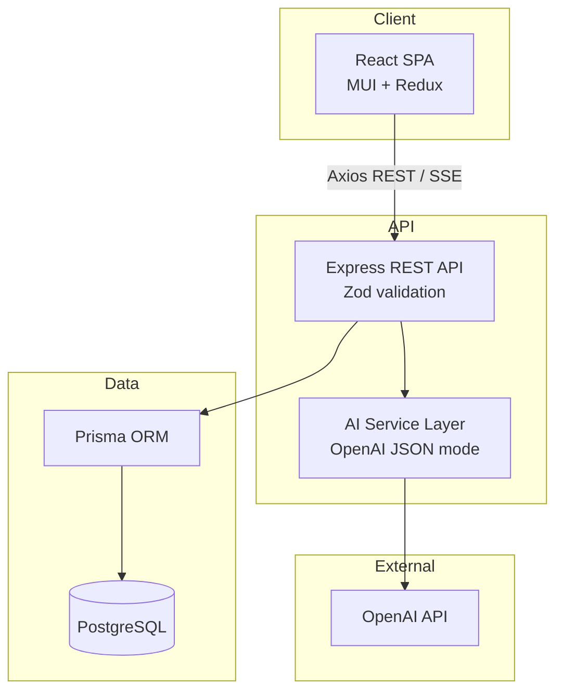
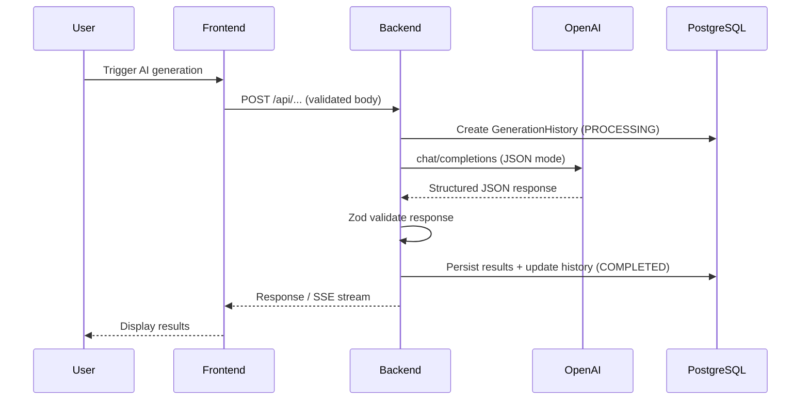
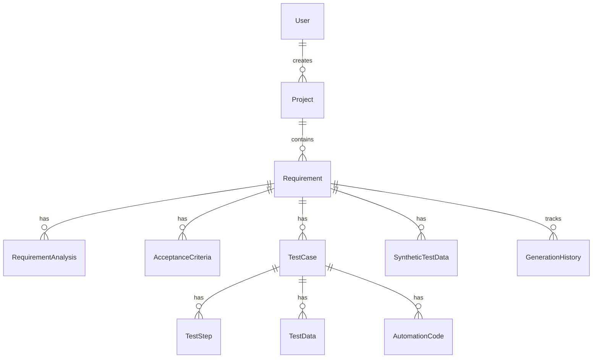

# AI Test Case & Requirement Generator

An enterprise-style, AI-powered QA platform that turns software requirements into structured analysis, acceptance criteria, test cases, synthetic test data, automation code, and coverage insights.

Built as a portfolio project demonstrating full-stack TypeScript architecture, OpenAI integration patterns, and production-minded engineering practices.

---

## Problem Statement

QA teams spend significant time manually translating requirements into test artifacts. Requirements are often ambiguous, coverage gaps are discovered late, and traceability from requirement → acceptance criteria → test case → automation is difficult to maintain.

This platform reduces that manual effort by:

1. Analyzing requirements with AI to surface actors, rules, risks, and ambiguities
2. Generating acceptance criteria in Given/When/Then format
3. Creating categorized test cases with steps and test data
4. Producing Playwright/Cypress/Selenium automation code
5. Analyzing coverage gaps with a traceability matrix
6. Maintaining a full audit trail of every AI generation run

---

## Features

| Area | Capabilities |
|------|-------------|
| **Dashboard** | Live metrics, charts, recent generation activity |
| **Requirements** | CRUD, AI analysis, acceptance criteria management |
| **Test Cases** | AI generation (SSE progress), CRUD, duplicate, regenerate, export (CSV/Excel/JSON) |
| **Test Data** | AI synthetic test data generation, CSV export |
| **Automation** | AI code generation for Playwright, Cypress, Selenium |
| **Coverage** | AI coverage analysis, traceability matrix, gap recommendations |
| **History** | Paginated audit log with filters, detail view, input/output snapshots |
| **Export** | Test cases (CSV/Excel/JSON), requirement analysis (PDF) |

---

## Architecture



### Request flow



---

## Tech Stack

| Layer | Technologies |
|-------|-------------|
| **Frontend** | React 19, TypeScript, Vite, MUI, Redux Toolkit, React Router, React Hook Form, Axios, Recharts |
| **Backend** | Node.js, Express 5, TypeScript, Zod, Helmet, express-rate-limit |
| **Database** | PostgreSQL 16, Prisma ORM |
| **AI** | OpenAI API (server-side only, JSON response mode) |
| **Testing** | Vitest, Supertest |
| **DevOps** | Docker Compose, GitHub Actions CI |

---

## AI Architecture

All AI logic lives in `backend/src/services/ai/`:

| Module | Purpose |
|--------|---------|
| `requirementAnalyzer.ts` | Structured requirement analysis |
| `acceptanceCriteriaGenerator.ts` | Given/When/Then criteria |
| `testCaseGenerator.ts` | Categorized test cases with steps |
| `testDataGenerator.ts` | Synthetic test data |
| `automationGenerator.ts` | Framework-specific automation code |
| `coverageAnalyzer.ts` | Coverage mapping and gap analysis |

### Design principles

- **Backend-only API key** — `OPENAI_API_KEY` never reaches the frontend
- **Modular prompts** — each service has isolated system/user prompt builders
- **Structured JSON output** — `response_format: { type: "json_object" }`
- **Zod validation** — every AI response is parsed and validated before persistence
- **Injectable callers** — testable without real OpenAI calls
- **Generation history** — input, output, model, status, and timestamp stored per run
- **Secret redaction** — history API redacts keys matching `apiKey`, `token`, `secret`, etc.
- **Rate limiting** — separate limits for general API (300/15min) and AI routes (30/15min)
- **Failure handling** — missing key → 503, OpenAI 429 → 503, invalid JSON → 502

---

## Database Architecture



Key enums: `TestCategory`, `GenerationType`, `GenerationStatus`, `RequirementPriority`.

---

## API Documentation

Base URL: `http://localhost:4001/api`

| Method | Path | Description |
|--------|------|-------------|
| GET | `/health` | Health check |
| GET | `/dashboard` | Metrics and charts |
| GET | `/projects` | List projects |
| GET/POST | `/requirements` | List / create requirements |
| GET/PUT/DELETE | `/requirements/:id` | Requirement CRUD |
| POST | `/requirements/:id/analyze` | AI requirement analysis |
| GET | `/test-cases` | List test cases (`?requirementId=`) |
| POST | `/test-cases/generate` | AI test case generation (SSE) |
| GET/PUT/DELETE | `/test-cases/:id` | Test case CRUD |
| POST | `/test-cases/:id/duplicate` | Duplicate test case |
| POST | `/test-cases/:id/regenerate` | Regenerate test case (SSE) |
| POST | `/automation/generate` | AI automation code |
| GET | `/automation/test-case/:testCaseId` | Latest automation code |
| GET/POST | `/acceptance-criteria` | List / create criteria |
| POST | `/acceptance-criteria/generate` | AI criteria generation |
| GET | `/test-data` | List synthetic test data |
| POST | `/test-data/generate` | AI test data generation |
| POST | `/coverage/analyze` | AI coverage analysis |
| GET | `/history` | Generation history (filters + pagination) |
| GET | `/history/:id` | Single history entry |

**Error format:** `{ "error": "message", "details": null | object }`

---

## Setup Instructions

### Prerequisites

- Node.js 20+
- npm
- Docker (recommended) or local PostgreSQL

### 1. Clone and configure

```bash
cd ai-test-case-generator
cp .env.example backend/.env
cp .env.example frontend/.env   # only VITE_API_URL needed
```

Set `OPENAI_API_KEY` in `backend/.env` for AI features.

### 2. Start database

```bash
docker compose up -d postgres
```

### 3. Backend

```bash
cd backend
npm install
npm run prisma:generate
npm run prisma:migrate
npm run prisma:seed
npm run dev
```

API: http://localhost:4001/api/health

### 4. Frontend

```bash
cd frontend
npm install
npm run dev
```

App: http://localhost:5174

### Root scripts

```bash
npm run lint      # Lint backend + frontend
npm run test      # Run all tests
npm run build     # Production builds
```

---

## Environment Variables

### Backend (`backend/.env`)

| Variable | Description | Default |
|----------|-------------|---------|
| `PORT` | API port | `4001` |
| `NODE_ENV` | Environment | `development` |
| `DATABASE_URL` | PostgreSQL connection string | — |
| `CORS_ORIGIN` | Allowed frontend origin | `http://localhost:5174` |
| `OPENAI_API_KEY` | **Server-side only** | — |
| `OPENAI_MODEL` | OpenAI model | `gpt-4o-mini` |
| `OPENAI_BASE_URL` | OpenAI API base URL | `https://api.openai.com/v1` |
| `RATE_LIMIT_MAX` | General API rate limit | `300` |
| `AI_RATE_LIMIT_MAX` | AI endpoint rate limit | `30` |

### Frontend (`frontend/.env`)

| Variable | Description | Default |
|----------|-------------|---------|
| `VITE_API_URL` | API base path | `/api` (Vite proxy) |

---

## Screenshots

> Add screenshots of the Dashboard, Requirement Analysis, Test Cases grid, Coverage page, and Generation History to `docs/screenshots/` for your portfolio README.

| Screen | Description |
|--------|-------------|
| Dashboard | Metrics, charts, recent activity |
| Requirements | CRUD + AI analysis panel |
| Test Cases | DataGrid with generation and export |
| Coverage | Traceability matrix and gap analysis |
| History | Filterable generation audit log |

---

## Example Workflow

1. **Create a requirement** — Healthcare claim submission with user story and acceptance notes
2. **Analyze** — AI extracts actors, business rules, functional requirements, risks, ambiguities
3. **Generate acceptance criteria** — Given/When/Then criteria derived from the requirement
4. **Generate test cases** — Functional, negative, security, edge, and regression tests with steps
5. **Generate synthetic test data** — Realistic field values for test execution
6. **Generate automation code** — Playwright TypeScript mapped to actual test steps
7. **Analyze coverage** — AI maps criteria to test cases; deterministic score from stored data
8. **Export** — Download test cases as Excel; export analysis as PDF
9. **Review history** — Open any previous generation to inspect input/output

---

## Testing

```bash
# Backend (24 tests)
cd backend && npm test

# Frontend (7 tests)
cd frontend && npm test

# All
npm test
```

Tests mock OpenAI responses — **no real API calls during automated tests**.

Coverage includes:
- AI response validation (automation, coverage, acceptance criteria)
- Coverage score computation
- History secret sanitization
- API health and 404 routes (Supertest)
- Frontend utilities (CSV export, analysis parsing, error messages)

---

## Docker

Run the full stack:

```bash
docker compose up --build
```

| Service | URL |
|---------|-----|
| Frontend | http://localhost:5174 |
| Backend API | http://localhost:4001/api/health |
| PostgreSQL | `localhost:5434` |

Set `OPENAI_API_KEY` in a `.env` file at the project root for AI features in Docker.

---

## CI/CD

GitHub Actions workflow (`.github/workflows/ci.yml`):

1. Install dependencies
2. Lint (ESLint)
3. Run tests (Vitest)
4. Build frontend and backend

Triggers on push/PR to `main` and `healthcare-SR`.

---

## Security

- OpenAI API key is server-side only
- Helmet security headers on all responses
- CORS restricted to configured frontend origin
- Rate limiting on API and AI endpoints
- Generation history redacts secret-like fields
- Zod validation on all request bodies
- Passwords stored as bcrypt hashes (demo seed data)

---

## Demo Seed Data

| Item | Value |
|------|-------|
| Project | Healthcare Claims Management System |
| Users | `sarah.chen@demo.health`, `marcus.johnson@demo.health` |
| Password | `DemoPass123!` |
| Requirements | 5 (eligibility, prior auth, adjudication, appeals, HIPAA) |
| Test cases | 5 with steps, test data, and automation samples |

---

## Future Improvements

- User authentication and role-based access control
- Real-time collaborative requirement editing
- AC ↔ test case mapping persistence (currently AI-inferred)
- Playwright test execution from generated automation code
- Jira/Azure DevOps integration for requirement import
- Multi-model support (Claude, Gemini) via provider abstraction
- E2E tests with Playwright against the full stack

---

## License

Portfolio / demo use.
